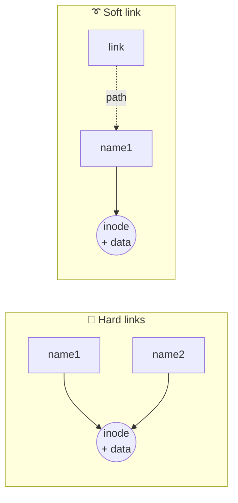

# 🐧 Linux Introduction

**🇬🇧 English** · [🇹🇷 Türkçe](./Linux%20Introduction.tr.md)

 

[⬅️ DevOps BootCamp: Linux](./)

✅ = correct, ❌ = wrong. Each option has a short explanation.

---

### Question 1

**Which OS was used in the origin of Linux?**

| | Option | Why |
|:-:|---|---|
| ❌ | FreeBSD | A separate BSD-family system, unrelated to Linux's origin. |
| ❌ | MacOS | Not the environment Linux was developed in. |
| ✅ | MINIX | Linus Torvalds started writing Linux while working on MINIX. |
| ❌ | OS/2 | IBM/Microsoft's system, unrelated to Linux's origin. |

> [!TIP]
> **Correct answer:** MINIX

---

### Question 2

**One of the first programs loaded on Linux start-up after the bootloader.**

| | Option | Why |
|:-:|---|---|
| ❌ | Grub | That is the bootloader itself, not what comes after it. |
| ✅ | Kernel | The bootloader loads the kernel into memory; it is the first core software to come up. |
| ❌ | Root | A user/directory name, not a program. |
| ❌ | Shell | Comes after the kernel is up and a user session starts. |

> [!TIP]
> **Correct answer:** Kernel

---

### Question 3

**Which program provides an interface between a user and an operating system (OS) kernel?**

| | Option | Why |
|:-:|---|---|
| ❌ | Lilo | An old boot loader. |
| ❌ | Linux daemon | A background service, not a user interface. |
| ✅ | Shell | Takes the commands you type, passes them to the kernel and shows the result. |

> [!TIP]
> **Correct answer:** Shell

---

### Question 4

**Does Linux make any assumptions about file content by its extension?**

| | Option | Why |
|:-:|---|---|
| ❌ | Yes | Linux does not guess the content from the extension. |
| ✅ | No | An extension is just part of the name. A `.txt` file can be a program, and a file without `.sh` can still run. What matters are permissions and the content itself. |

> [!TIP]
> **Correct answer:** No

---

### Question 5

**Mark all Linux related file systems.**

| | Option | Why |
|:-:|---|---|
| ✅ | EXT2 | The classic Linux filesystem. |
| ✅ | EXT3 | EXT2 plus journaling. |
| ✅ | EXT4 | The most widely used Linux filesystem today. |
| ❌ | NTFS | Windows' filesystem. (Linux can read/write it, but it isn't Linux's own.) |
| ✅ | ReiserFS | A journaling filesystem developed for Linux. |
| ✅ | XFS | Strong with large files and disks, common on Linux. |

> [!TIP]
> **Correct answer:** EXT2, EXT3, EXT4, ReiserFS, XFS

---

### Question 6

**What is true about Hard links?**

| | Option | Why |
|:-:|---|---|
| ✅ | Hard link is a direct pointer to an inode | Points straight at the file's inode, like a second name for the same data. |
| ❌ | One file cannot have more then 3 Hard links | There is no such limit of 3. |
| ✅ | Hard link has the same attributes as an original file | Both share the same inode, so permissions, owner and size are identical. |
| ✅ | Changes in any reflect in all | There is one copy of the data; a change through any name shows up in all. |
| ❌ | File cannot be accessable by Hard link after deletion of the original one | Even if you delete the original name, the inode and data stay while another hard link exists, so you can still access the file. |
| ✅ | Hard link could be created only whithin the same filesystem | Inode numbers are per filesystem, so hard links can't cross filesystems. |

> [!TIP]
> **Correct answer:** 1st, 3rd, 4th and 6th options

---

### Question 7

**What is true about Soft links?**

| | Option | Why |
|:-:|---|---|
| ❌ | Soft link is a direct pointer to an inode | That's a hard link property. A soft link stores the file's path, not its inode. |
| ❌ | One file cannot have more then 5 Soft links | There is no such limit. |
| ❌ | Soft link has the same attributes as an original file | A soft link is a separate file with its own permissions and size. |
| ✅ | If removed, the original file will remain | Removing the link only removes the shortcut; the real file stays. |
| ✅ | File cannot be accessable by Soft link after deletion of the original one | If the original is deleted the link dangles and access fails. |

> [!TIP]
> **Correct answer:** 4th and 5th options

---

### Question 8

**What is correct order of adding new disk to LVM?**

| | Option | Why |
|:-:|---|---|
| ❌ | pvcreate > lgcreate > lvcreate > mkfs | There is no `lgcreate` command. |
| ❌ | pvcreate > lvcreate > lgcreate > mkfs | Again no `lgcreate`, and the order is wrong. |
| ✅ | pvcreate > vgcreate > lvcreate > mkfs | First make the disk a physical volume, add it to a volume group, create a logical volume, and finally build the filesystem. |
| ❌ | pvcreate > lvcreate > vgcreate > mkfs | You can't create a logical volume without a volume group; the order is reversed. |

> [!TIP]
> **Correct answer:** pvcreate > vgcreate > lvcreate > mkfs

---

### Question 9

**What commands could show information about swap usage?**

| | Option | Why |
|:-:|---|---|
| ✅ | `cat /proc/swaps` | Shows active swap areas and their usage. |
| ✅ | `swapon` | `swapon --show` lists swap areas and usage. |
| ✅ | `free -h` | Shows swap usage together with RAM, human-readable. |
| ❌ | `makeswap` | No such command. The one that creates swap is `mkswap`, and it doesn't show usage. |

> [!TIP]
> **Correct answer:** `cat /proc/swaps`, `swapon`, `free -h`

---

### Question 10

**What is not a boot loader?**

| | Option | Why |
|:-:|---|---|
| ❌ | LILO | A real boot loader (the old Linux Loader). |
| ✅ | LIFO | Last In First Out, a data-structure concept (stack), not a boot loader. |
| ✅ | FIFO | First In First Out, queue logic, not a boot loader. |
| ❌ | GRUB | The most common Linux boot loader. |

> [!TIP]
> **Correct answer:** LIFO and FIFO. (If the exam wants a single answer, pick one of them; neither is a boot loader.)

---

### Question 11

**Linux system normally boots with graphics with _ Runlevel**

| | Option | Why |
|:-:|---|---|
| ❌ | 1 | Single-user (rescue) mode. |
| ❌ | 3 | Multi-user with networking but no GUI (text only). |
| ✅ | 5 | Multi-user with a graphical interface; the desktop starts at this level. |
| ❌ | 6 | Reboot. |

> [!TIP]
> **Correct answer:** 5

---

### Question 12

**This Runlevel is used for system reboot**

| | Option | Why |
|:-:|---|---|
| ❌ | 1 | Single-user (rescue) mode. |
| ❌ | 3 | Text-based multi-user mode. |
| ❌ | 5 | Graphical multi-user mode. |
| ✅ | 6 | Used to reboot the system. |

> [!TIP]
> **Correct answer:** 6

---

## 🗺️ Cheat sheet

**Boot sequence**

**Runlevels**

| Runlevel | Meaning |
|:-:|---|
| 1 | Single-user (rescue) |
| 3 | Multi-user, text only |
| 5 | Multi-user, graphical |
| 6 | Reboot |

**Hard link vs soft link**

| | Hard link | Soft link |
|---|:-:|:-:|
| Points to | inode | path |
| Across filesystems | ❌ | ✅ |
| Survives deletion of the original name | ✅ | ❌ (dangling) |
| Own attributes | ❌ (shared) | ✅ |

**LVM order**

