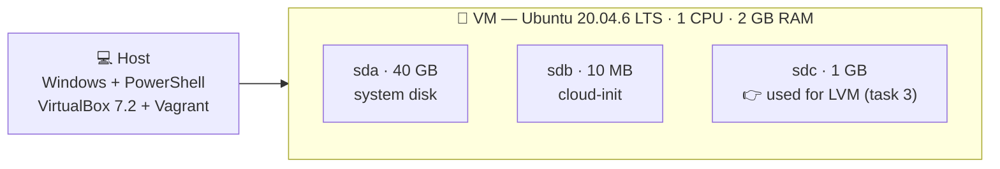

<div align="center">


**🇬🇧 English** · [🇹🇷 Türkçe](./README.tr.md)


**12 Linux configuration tasks on an Ubuntu 20.04 VM — users, LVM, swap, Docker, NGINX, cron, logrotate, file attributes and networking.**

[📋 Task](./TASK.md) · [🛠️ Solution](./SOLUTION.md) · [🚀 Quick start](#-quick-start) · [📁 Structure](#-folder-structure)

</div>

---

## 📚 Documents

| | File | What's inside |
|:-:|---|---|
| 📋 | [TASK.md](./TASK.md) | What is asked: requirements, points, prerequisites, key concepts |
| 🛠️ | [SOLUTION.md](./SOLUTION.md) | How it was solved: commands, short rationale, screenshots, problems & fixes |
| ⚙️ | [Vagrantfile](./Vagrantfile) | Creates the VM and the 1 GB second disk |
| 🖼️ | [screenshots/](./screenshots) | Proof for every step, named by task number |

## 🎯 Result

<div align="center">

### ✅ 27 / 27 tests passed (100%)

</div>

## 🧩 Tasks at a glance

| # | Task | Topics | Result |
|:-:|---|---|:-:|
| 1 | Change of VM hostname | `hostnamectl`, `/etc/hosts`, cloud-init | ✅ |
| 2 | User Creation | `useradd`, `groupadd`, UID/GID | ✅ |
| 3 | LVM Configuration | PV · VG · LV, ext4, fstab (UUID) | ✅ |
| 4 | Sudo Rights | `/etc/sudoers.d/`, `visudo`, `NOPASSWD` | ✅ |
| 5 | Swap Creation | swap file, fstab | ✅ |
| 6 | Docker Installation | Docker repo, version pinning, `docker` group | ✅ |
| 7 | NGINX Installation | port 8080, static JSON page | ✅ |
| 8 | Cron Job | crontab, Unix timestamp | ✅ |
| 9 | NGINX Logrotate | `logrotate` | ✅ |
| 10 | Immutable file | `chattr +i`, permissions | ✅ |
| 11 | Bash Alias Creating | `.bashrc`, alias | ✅ |
| 12 | Static Route | netplan, persistent route | ✅ |

## 💾 VM layout



## 🚀 Quick start

**Requirements:** [VirtualBox](https://www.virtualbox.org/) and [Vagrant](https://www.vagrantup.com/).

```powershell
# In this folder (PowerShell). On Mac/Linux: export VAGRANT_EXPERIMENTAL="disks"
$env:VAGRANT_EXPERIMENTAL="disks"   # needed for the second disk (experimental "disks" feature)
vagrant up
vagrant ssh
```

Inside the VM:

```bash
sudo apt update && sudo apt install -y jq
cp /vagrant/checker ~ && chmod +x ~/checker      # you must place the checker file in this folder first
./checker -course 'linux' -course-version 'v1.0' -test-suite 'vm_task'
```

Then follow [SOLUTION.md](./SOLUTION.md) task by task.

## 📝 Notes

> [!IMPORTANT]
> **The checker binary is not in the repo.** Download the build that matches the VM's architecture from the course page (**AMD64** for Linux x86_64) and put it in this folder. `.gitignore` keeps it out of git.

> [!NOTE]
> **No secret phrases in the repo.** The checker prints them as the proof of each task; enter them on the course page.

> [!TIP]
> Some commands (Docker version, `yq` download URL) depend on upstream releases and may change over time.

The `Vagrantfile` is identical to the one in the course material.

## 📁 Folder structure

```text
VM Task/
├── README.md            🇬🇧 overview
├── README.tr.md         🇹🇷 genel bakış
├── TASK.md              🇬🇧 task description
├── TASK.tr.md           🇹🇷 görev tanımı
├── SOLUTION.md          🇬🇧 solution
├── SOLUTION.tr.md       🇹🇷 çözüm
├── Vagrantfile
├── .gitignore
├── assets/
│   └── banner.svg
└── screenshots/
    ├── 00-prereq-*.png          # VM preparation
    ├── 01-hostname-*.png
    ├── 02-user-creation.png
    ├── 03-lvm-*.png
    ├── 04-sudo-*.png
    ├── 05-swap-create.png
    ├── 06-docker-*.png
    ├── 07-nginx-*.png
    ├── 08-cron-*.png
    ├── 09-logrotate-after.png
    ├── 10-immutable-file.png
    ├── 11-alias-*.png
    └── 12-route-*.png
```
