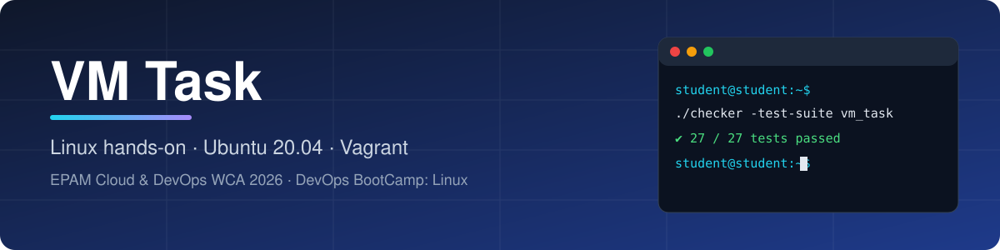
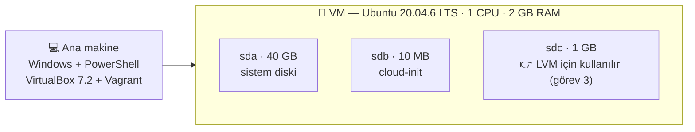

<div align="center">



[🇬🇧 English](./README.md) · **🇹🇷 Türkçe**


**Ubuntu 20.04 VM üzerinde 12 Linux yapılandırma görevi — kullanıcılar, LVM, swap, Docker, NGINX, cron, logrotate, dosya özellikleri ve ağ.**

[📋 Görev](./TASK.tr.md) · [🛠️ Çözüm](./SOLUTION.tr.md) · [🚀 Hızlı başlangıç](#-hızlı-başlangıç) · [📁 Yapı](#-klasör-yapısı)

</div>

---

## 📚 Dokümanlar

| | Dosya | İçerik |
|:-:|---|---|
| 📋 | [TASK.tr.md](./TASK.tr.md) | Ne isteniyor: gereksinimler, puanlar, ön koşullar, temel kavramlar |
| 🛠️ | [SOLUTION.tr.md](./SOLUTION.tr.md) | Nasıl çözüldü: komutlar, kısa gerekçe, ekran görüntüleri, sorunlar ve çözümleri |
| ⚙️ | [Vagrantfile](./Vagrantfile) | VM'i ve 1 GB'lik ikinci diski oluşturur |
| 🖼️ | [screenshots/](./screenshots) | Her adımın kanıtı, görev numarasına göre adlandırılmış |

## 🎯 Sonuç

<div align="center">

### ✅ 27 / 27 test geçti (%100)

</div>

## 🧩 Görevlere bir bakış

| # | Görev | Konu | Sonuç |
|:-:|---|---|:-:|
| 1 | Change of VM hostname | `hostnamectl`, `/etc/hosts`, cloud-init | ✅ |
| 2 | User Creation | `useradd`, `groupadd`, UID/GID | ✅ |
| 3 | LVM Configuration | PV · VG · LV, ext4, fstab (UUID) | ✅ |
| 4 | Sudo Rights | `/etc/sudoers.d/`, `visudo`, `NOPASSWD` | ✅ |
| 5 | Swap Creation | swap dosyası, fstab | ✅ |
| 6 | Docker Installation | Docker repository, sürüm sabitleme, `docker` grubu | ✅ |
| 7 | NGINX Installation | port 8080, statik JSON sayfası | ✅ |
| 8 | Cron Job | crontab, Unix timestamp | ✅ |
| 9 | NGINX Logrotate | `logrotate` | ✅ |
| 10 | Immutable file | `chattr +i`, izinler | ✅ |
| 11 | Bash Alias Creating | `.bashrc`, alias | ✅ |
| 12 | Static Route | netplan, kalıcı route | ✅ |

## 💾 VM yapısı



## 🚀 Hızlı başlangıç

**Gereksinimler:** [VirtualBox](https://www.virtualbox.org/) ve [Vagrant](https://www.vagrantup.com/).

```powershell
# Bu klasörde (PowerShell). Mac/Linux için: export VAGRANT_EXPERIMENTAL="disks"
$env:VAGRANT_EXPERIMENTAL="disks"   # ikinci disk için gerekli (deneysel "disks" özelliği)
vagrant up
vagrant ssh
```

VM içinde:

```bash
sudo apt update && sudo apt install -y jq
cp /vagrant/checker ~ && chmod +x ~/checker      # checker dosyasını önce bu klasöre koymanız gerekir
./checker -course 'linux' -course-version 'v1.0' -test-suite 'vm_task'
```

Sonra görevleri sırayla [SOLUTION.tr.md](./SOLUTION.tr.md) ile çözün.

## 📝 Notlar

> [!IMPORTANT]
> **Checker dosyası repoda yoktur.** Kurs sayfasından VM'in mimarisine uygun sürümü (Linux x86_64 için **AMD64**) indirip bu klasöre koyun. `.gitignore` onu git dışında tutar.

> [!NOTE]
> **Secret phrase'ler repoda yoktur.** Checker bunları her görevin kanıtı olarak üretir; kurs sayfasındaki alanlara girilir.

> [!TIP]
> Bazı komutlar (Docker sürümü, `yq` indirme adresi) yayın adreslerine bağlıdır ve zamanla değişebilir.

`Vagrantfile`, kurs materyalindeki dosyayla aynıdır.

## 📁 Klasör yapısı

```text
VM Task/
├── README.md            🇬🇧 overview
├── README.tr.md         🇹🇷 genel bakış
├── TASK.md              🇬🇧 task description
├── TASK.tr.md           🇹🇷 görev tanımı
├── SOLUTION.md          🇬🇧 solution
├── SOLUTION.tr.md       🇹🇷 çözüm
├── Vagrantfile
├── .gitignore
├── assets/
│   └── banner.svg
└── screenshots/
    ├── 00-prereq-*.png          # VM ön hazırlık
    ├── 01-hostname-*.png
    ├── 02-user-creation.png
    ├── 03-lvm-*.png
    ├── 04-sudo-*.png
    ├── 05-swap-create.png
    ├── 06-docker-*.png
    ├── 07-nginx-*.png
    ├── 08-cron-*.png
    ├── 09-logrotate-after.png
    ├── 10-immutable-file.png
    ├── 11-alias-*.png
    └── 12-route-*.png
```
