# VM Task: Çözüm

Her görev için yapılan işlem, komutlar, kısa gerekçe ve ekran görüntüsü. Görevin kendisi için bkz. [TASK.md](./TASK.md).

## İçindekiler

- [Ortam](#ortam)
- [Ön hazırlık](#ön-hazırlık)
- [1. Hostname](#1-change-of-vm-hostname)
- [2. User Creation](#2-user-creation)
- [3. LVM Configuration](#3-lvm-configuration)
- [4. Sudo Rights](#4-sudo-rights)
- [5. Swap Creation](#5-swap-creation)
- [6. Docker Installation](#6-docker-installation)
- [7. NGINX Installation](#7-nginx-installation)
- [8. Cron Job](#8-cron-job)
- [9. NGINX Logrotate](#9-nginx-logrotate)
- [10. Immutable file](#10-make-an-immutable-file-immutabletxt)
- [11. Bash Alias](#11-bash-alias-creating)
- [12. Static Route](#12-static-route)
- [Sonuç](#sonuç)
- [Karşılaşılan sorunlar](#karşılaşılan-sorunlar)

## Ortam

| | |
|---|---|
| Ana makine | Windows, PowerShell |
| Sanallaştırma | VirtualBox 7.2 + Vagrant |
| Box | `ubuntu/focal64` |
| VM işletim sistemi | Ubuntu 20.04.6 LTS (x86_64) |
| VM kaynakları | 1 CPU, 2 GB RAM |
| Diskler | `sda` 40 GB (sistem), `sdb` 10 MB (cloud-init), `sdc` 1 GB (LVM için) |

## Ön hazırlık

VM, bu klasördeki [Vagrantfile](./Vagrantfile) ile oluşturuldu (PowerShell):

```powershell
$env:VAGRANT_EXPERIMENTAL="disks"   # disks özelliği için gerekli
vagrant up
vagrant ssh
```

VM içinde başlangıç durumu ve gerekli araçlar:

```bash
lsblk                                   # 1G'lik sdc diski görünmeli
swapon --show                           # boş çıkmalı (swap yok)
sudo apt update && sudo apt install -y jq
cp /vagrant/checker ~ && chmod +x ~/checker
```

`/vagrant`, ana makinedeki proje klasörünün VM içindeki paylaşımıdır. Checker dosyası buradan kopyalandı.

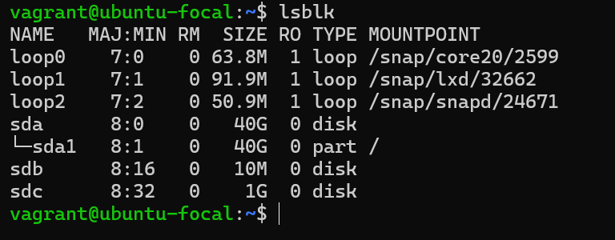

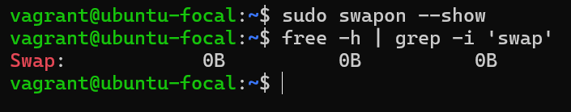

---

## 1. Change of VM hostname

**Hedef:** hostname `student`, `127.0.0.1`'e çözülsün, kalıcı olsun.

```bash
echo '127.0.0.1 student' | sudo tee -a /etc/hosts
sudo hostnamectl set-hostname student
sudo sed -i 's/^preserve_hostname: false/preserve_hostname: true/' /etc/cloud/cloud.cfg
grep preserve_hostname /etc/cloud/cloud.cfg
```

**Neden böyle?**

- Önce `/etc/hosts`'a yeni ismi ekliyoruz. Aksi halde sonraki `sudo` komutları `unable to resolve host` uyarısı verir.
- `hostnamectl set-hostname` hostname'i kalıcı olarak `/etc/hostname`'e yazar.
- Vagrant/cloud-init imajlarında `cloud-init` açılışta hostname'i sıfırlayabilir. `preserve_hostname: true` bunu engeller.

**Kontrol:** `hostname -s`, `-f` → `student`, `hostname -i` → `127.0.0.1`.

Başlangıçtaki `/etc/hosts`:

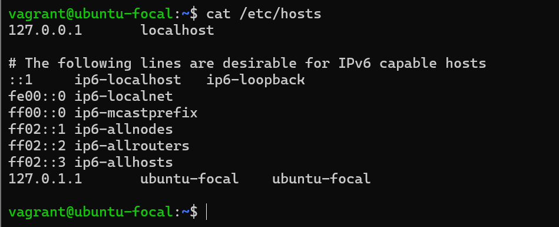

Değişiklikten sonra:

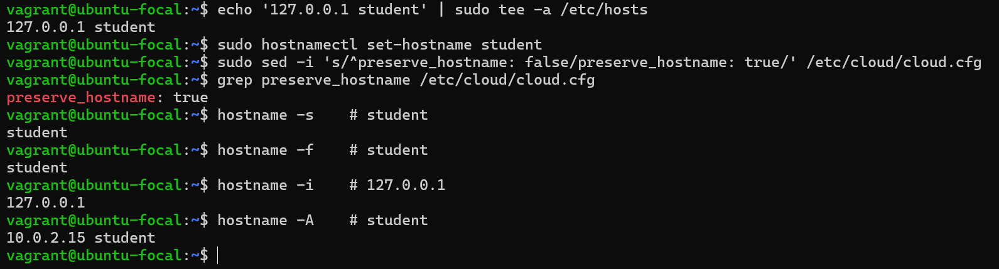

---

## 2. User Creation

**Hedef:** `student`, UID 1040, ana grup `student_group` (GID 1050), home `/home/student_home`, ek grup `cdrom`.

```bash
sudo groupadd -g 1050 student_group
sudo useradd -u 1040 -g student_group -G cdrom -d /home/student_home -m -s /bin/bash student
sudo passwd student
id student
```

**Neden böyle?**

- Ana grup, kullanıcıdan **önce** var olmalı. Bu yüzden `groupadd` önce çalışır.
- `-g` ana grup, `-G` ek gruplar, `-d` home dizini, `-m` home dizinini oluşturur.
- Şifre, sonraki görevlerde (`su`, `sudo` testi) lazım olacağı için verildi.

**Beklenen çıktı:** `uid=1040(student) gid=1050(student_group) groups=1050(student_group),24(cdrom)`

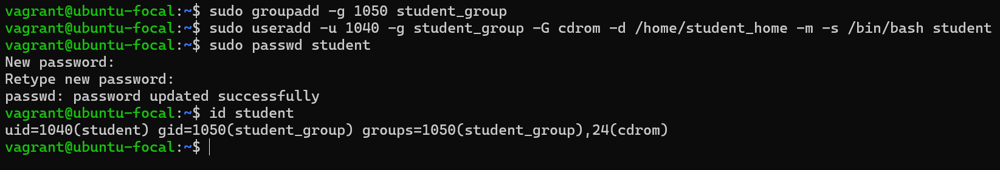

---

## 3. LVM Configuration

**Hedef:** `sdc` üzerinde PV, VG `student`, LV `student` (boş alanın %50'si), ext4, `/lvm/student`'e UUID ile kalıcı mount.

```bash
sudo pvcreate /dev/sdc
sudo vgcreate student /dev/sdc
sudo lvcreate -l 50%FREE -n student student
sudo mkfs.ext4 /dev/student/student
sudo mkdir -p /lvm/student

UUID=$(sudo blkid -s UUID -o value /dev/student/student)
echo "UUID=$UUID /lvm/student ext4 defaults 0 2" | sudo tee -a /etc/fstab
sudo mount -a
```

**Neden böyle?**

- LVM katmanları sırayla kurulur: **PV** (fiziksel disk) → **VG** (disk havuzu) → **LV** (kullanılan mantıksal bölüm) → dosya sistemi.
- `-l 50%FREE`: volume group'taki boş alanın yarısı (yaklaşık 508 MiB).
- fstab'a **UUID** yazıyoruz çünkü `/dev/sdX` adları yeniden başlatmada değişebilir, UUID değişmez.
- `mount -a` fstab'daki tüm kayıtları dener. Hata vermemesi, satırın doğru olduğunu gösterir.

**Kontrol:** `lsblk | grep student-student`, `mount | grep student-student`, `sudo lvdisplay`.

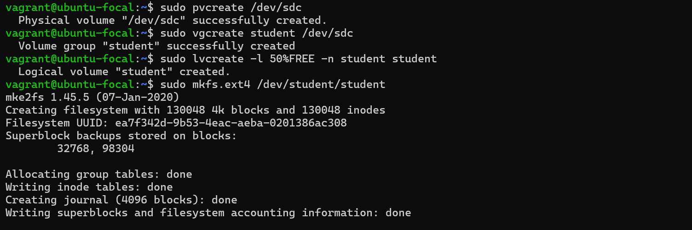

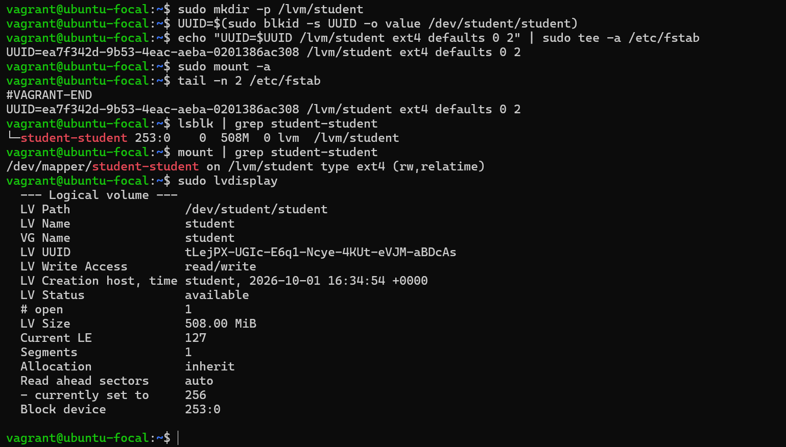

---

## 4. Sudo Rights

**Hedef:** `student`, `apt install` ve `apt-get install`'ı şifresiz, diğer sudo komutlarını şifreyle çalıştırsın. Varsayılan `/etc/sudoers` değişmesin.

```bash
which apt apt-get                          # /usr/bin/apt, /usr/bin/apt-get
sudo visudo -f /etc/sudoers.d/student
```

Dosyanın içeriği:

```
student ALL=(ALL) ALL
student ALL=(ALL) NOPASSWD: /usr/bin/apt install *, /usr/bin/apt-get install *
```

**Neden böyle?**

- **Best practice:** `/etc/sudoers`'a dokunmak yerine `/etc/sudoers.d/` altında kullanıcıya özel dosya kullanılır. Paket güncellemeleri ana dosyayı değiştirse bile ayar korunur.
- `visudo -f` dosyayı kaydederken sözdizimini kontrol eder. Hatalı kayıt sudo'yu bozabilir, `visudo` bunu engeller.
- Sudoers'ta **son eşleşen kural kazanır**. Genel kural (`ALL`, şifreli) üstte, özel kural (`NOPASSWD`, sadece apt install) altta olmalı.
- Komutların tam yolu (`/usr/bin/apt`) yazılır, böylece başka bir `apt` çalıştırılamaz.
- Dosya izni `440` (`-r--r-----`) olmalı. `visudo` bunu kendisi ayarlar.

> `/etc/sudoers.d/` dizinini sadece root okuyabilir. Normal kullanıcıyla `ls -l /etc/sudoers.d/student` yazınca "Permission denied" gelmesi normaldir, başına `sudo` gerekir.

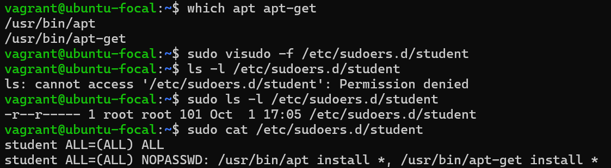

**Test** (`su - student` ile, her adım arasında `sudo -k`):

- `sudo echo` → şifre **sorar**
- `sudo apt install tree` → şifre **sormaz**
- `sudo apt update` → şifre **sorar**

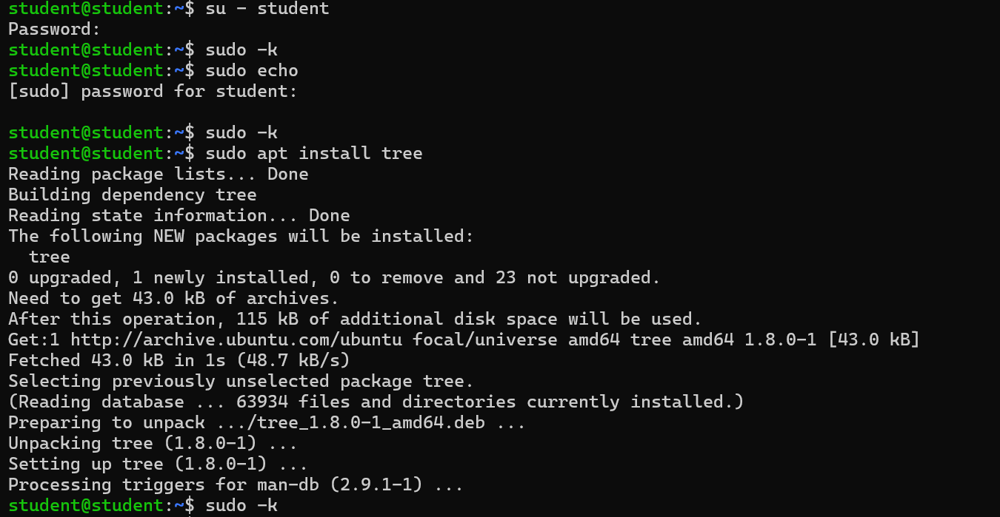

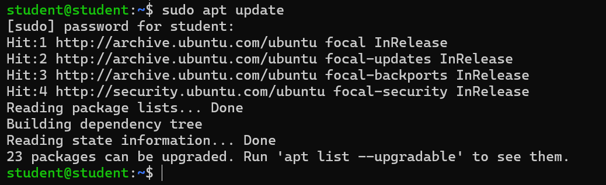

---

## 5. Swap Creation

**Hedef:** 1 GB `/swapfile`, reboot sonrası da aktif.

```bash
sudo fallocate -l 1G /swapfile
sudo chmod 600 /swapfile
sudo mkswap /swapfile
sudo swapon /swapfile
echo '/swapfile none swap sw 0 0' | sudo tee -a /etc/fstab
sudo swapon --show
free -h | grep -i swap
```

**Neden böyle?**

- `fallocate` istenen boyutta dosyayı hızlıca ayırır.
- `chmod 600`: swap dosyası sadece root'a açık olmalı, aksi halde bellek içeriği başkalarınca okunabilir.
- `mkswap` dosyayı swap alanı olarak biçimlendirir, `swapon` etkinleştirir.
- fstab kaydı, swap'ın her açılışta otomatik etkinleşmesini sağlar.

**Beklenen:** `swapon --show` → `/swapfile file 1024M`, `free -h` → `Swap: 1.0Gi`.

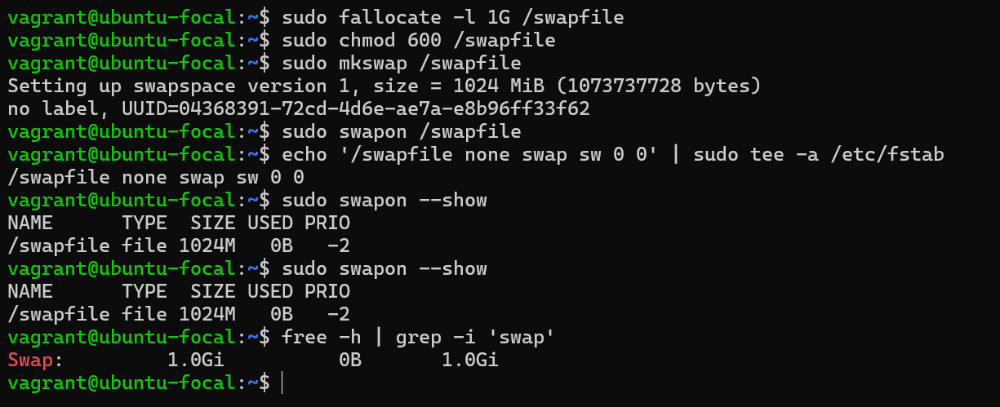

---

## 6. Docker Installation

**Hedef:** Docker repository'sinden Docker **19.03.15**, `student` kullanıcısı çalıştırabilsin.

Başlangıçta Docker kurulu değil:

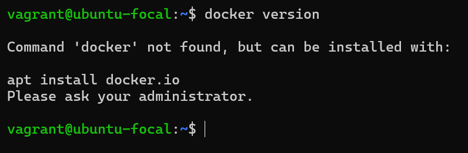

```bash
# 1. Gerekli paketler
sudo apt update
sudo apt install -y ca-certificates curl gnupg lsb-release

# 2. Docker GPG anahtarı
sudo mkdir -p /etc/apt/keyrings
curl -fsSL https://download.docker.com/linux/ubuntu/gpg | sudo gpg --dearmor -o /etc/apt/keyrings/docker.gpg

# 3. Docker repository'si
echo "deb [arch=$(dpkg --print-architecture) signed-by=/etc/apt/keyrings/docker.gpg] https://download.docker.com/linux/ubuntu $(lsb_release -cs) stable" | sudo tee /etc/apt/sources.list.d/docker.list
sudo apt update

# 4. Sürümü bul ve kur
apt-cache madison docker-ce | grep 19.03.15
VER="5:19.03.15~3-0~ubuntu-focal"
sudo apt install -y docker-ce=$VER docker-ce-cli=$VER containerd.io

# 5. Kullanıcıları docker grubuna ekle
sudo usermod -aG docker student
sudo usermod -aG docker vagrant
```

**Neden böyle?**

- Ubuntu'nun kendi `docker.io` paketi yerine **resmi Docker repository'si** isteniyor, bu yüzden repo ve GPG anahtarı eklenir. `signed-by` ile paketlerin imzası doğrulanır.
- `apt-cache madison` repoda hangi sürümlerin olduğunu listeler, tam sürüm adı (`5:19.03.15~3-0~ubuntu-focal`) buradan alınır.
- Belirli bir sürüm istendiği için `docker-ce` ve `docker-ce-cli` aynı sürüme sabitlenir.
- `docker` grubundaki kullanıcılar `/var/run/docker.sock`'a erişebilir, yani `sudo` olmadan Docker çalıştırabilir. Grup değişikliği **yeni oturumda** geçerli olur (`exit` ve tekrar giriş).

**Kontrol:** hem Client hem Server `19.03.15` göstermeli.

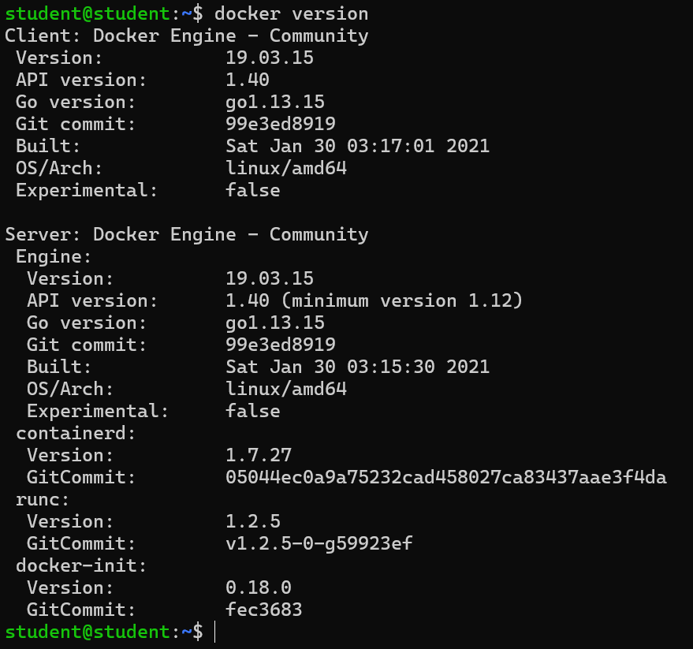

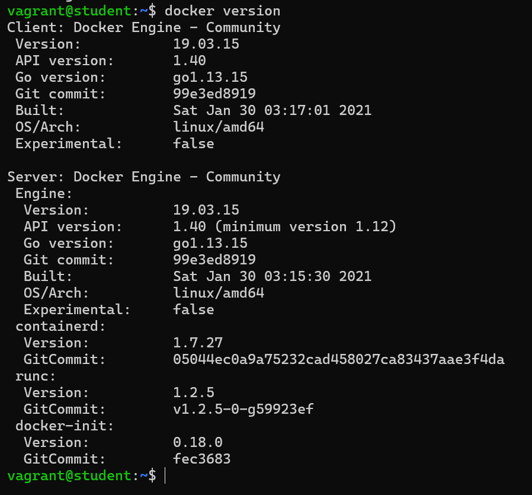

---

## 7. NGINX Installation

**Hedef:** NGINX 8080 portunda çalışsın, statik sayfa `name`, `os`, `ip`, `cpu`, `memory` alanlarıyla JSON döndürsün.

```bash
sudo apt install -y nginx

# Portu 80 yerine 8080 yap
sudo sed -i 's/listen 80 default_server;/listen 8080 default_server;/; s/listen \[::\]:80 default_server;/listen [::]:8080 default_server;/' /etc/nginx/sites-available/default
grep listen /etc/nginx/sites-available/default

# JSON sayfası (değerler komutlarla otomatik doldurulur)
sudo tee /var/www/html/index.html > /dev/null <<EOF
{
  "name": "student",
  "os": "$(. /etc/os-release && echo $PRETTY_NAME)",
  "ip": "$(hostname -I | awk '{print $1}')",
  "cpu": "$(nproc)",
  "memory": "$(free -m | awk '/Mem:/ {printf "%.1f", $2/1024}')"
}
EOF

sudo nginx -t
sudo systemctl restart nginx
sudo systemctl enable nginx
```

**Neden böyle?**

- Varsayılan site `listen 80` ile gelir. IPv4 (`listen 8080`) ve IPv6 (`listen [::]:8080`) satırlarının ikisi de değiştirilir.
- `index.html` NGINX'in varsayılan sayfa dizinindedir (`/var/www/html`). Dosya içindeki `$(...)` ifadeleri, dosya yazılırken çalıştırılıp gerçek değerlerle değiştirilir (heredoc'ta `EOF` tırnaksız olduğu için).
- `nginx -t` yapılandırma hatalarını servisi yeniden başlatmadan yakalar.
- `enable` servisin açılışta otomatik başlamasını sağlar.

**Kontrol:**

```bash
sudo ss -lntp | grep 8080
curl student:8080
curl -s student:8080 | jq .
```

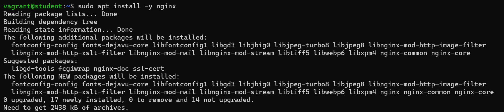

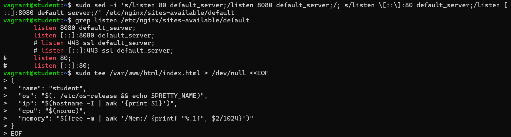

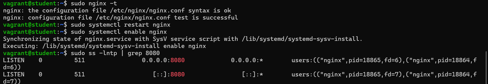

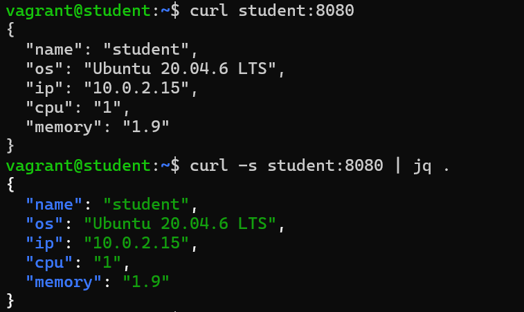

---

## 8. Cron Job

**Hedef:** `/etc/nginx/nginx.conf` dosyasını `/etc/nginx/conf.d/nginx-<timestamp>.conf.bak` olarak yedekle. Ek script kullanma.

Başlangıçta `conf.d` boş:

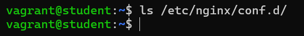

```bash
systemctl is-active cron
(sudo crontab -l 2>/dev/null; echo '* * * * * cp /etc/nginx/nginx.conf /etc/nginx/conf.d/nginx-$(date +\%s).conf.bak') | sudo crontab -
sudo crontab -l
sleep 70
ls /etc/nginx/conf.d/
```

**Neden böyle?**

- `/etc/nginx/conf.d/` dizinine sadece root yazabilir. Bu yüzden iş **root'un crontab'ına** (`sudo crontab`) eklenir.
- `date +%s`, 1970-01-01'den bu yana geçen saniyeyi verir (Unix timestamp).
- Crontab'ta `%` karakteri özel anlam taşıdığı için `\%` yazılır.
- Yedek dosyaları `.conf.bak` ile bittiği için NGINX bunları yapılandırmaya dahil etmez (`conf.d/*.conf` sadece `.conf` ile bitenleri okur).
- Test için `* * * * *` (her dakika) kullanıldı, bu yüzden bir dakika içinde sonuç görülür.

> Üretim ortamında her dakika yedek almak yerine saatlik/günlük sıklık (`0 * * * *`) daha mantıklıdır, aksi halde dizin hızla dolar.

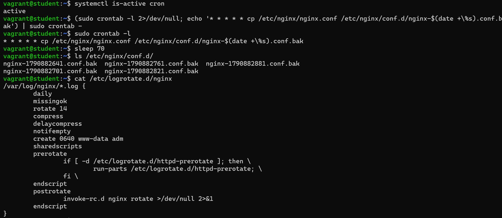

---

## 9. NGINX Logrotate

**Hedef:** NGINX logları günlük yerine **haftalık** döndürülsün.

Önceki ayar yukarıdaki görselin alt kısmında görünüyor (`daily`, `rotate 14`).

```bash
sudo sed -i 's/\bdaily\b/weekly/' /etc/logrotate.d/nginx
grep -E 'daily|weekly|rotate' /etc/logrotate.d/nginx
sudo logrotate -d /etc/logrotate.d/nginx 2>&1 | grep -i rotating
```

**Neden böyle?**

- `logrotate` ayarları `/etc/logrotate.d/` altındaki dosyalardadır. NGINX için `daily` ifadesi `weekly` ile değiştirilir.
- `\b` kelime sınırıdır, sadece `daily` kelimesini hedefler.
- `logrotate -d` (debug) hiçbir şeyi değiştirmeden kuralın nasıl yorumlandığını gösterir.

**Beklenen:** `rotating pattern: /var/log/nginx/*.log  weekly (14 rotations)`

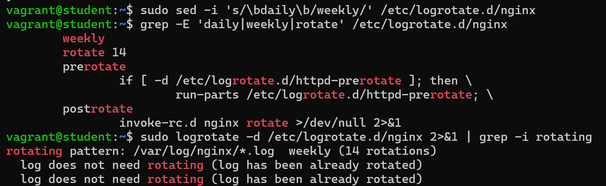

---

## 10. Make an immutable file /immutable.txt

**Hedef:** sahibi `student`, grubu `cdrom`, herkese tüm izinler, kimse silemesin.

```bash
sudo touch /immutable.txt
sudo chown student:cdrom /immutable.txt
sudo chmod 777 /immutable.txt
sudo chattr +i /immutable.txt

ls -l /immutable.txt
lsattr /immutable.txt
sudo rm /immutable.txt        # Operation not permitted
```

**Neden böyle?**

- `chattr +i`, dosyaya **immutable** (değiştirilemez) bayrağı koyar. Bu durumda dosya **root dahil kimse tarafından** silinemez, yeniden adlandırılamaz veya değiştirilemez.
- Bayrak verildikten sonra sahip ve izinler de değiştirilemez, bu yüzden `chattr +i` **en son** çalıştırılır.
- Bayrağı kaldırmak için `sudo chattr -i /immutable.txt` gerekir.

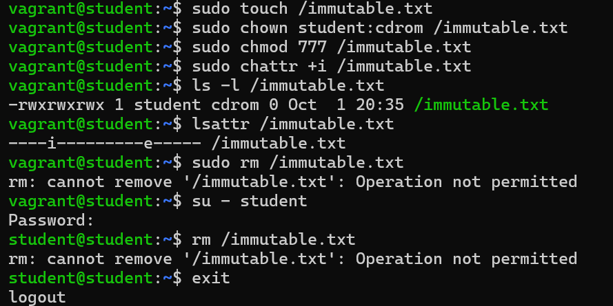

---

## 11. Bash Alias Creating

**Hedef:** `student` için `eip` alias'ı dış IP'yi göstersin, kalıcı olsun.

Alias başlangıçta yok:

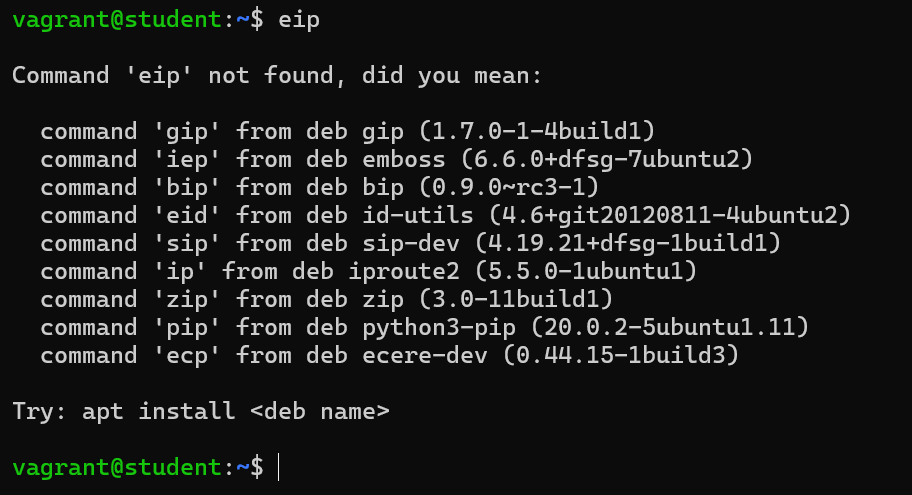

```bash
echo "alias eip='curl -s ifconfig.me; echo'" | sudo tee -a /home/student_home/.bashrc
grep -n eip /home/student_home/.bashrc
su - student
eip
```

**Neden böyle?**

- `student`'ın home dizini `/home/student_home` olduğu için alias oraya yazılır (`/home/student/.bashrc` değil).
- `.bashrc` her interaktif Bash oturumunda okunur, bu yüzden alias reboot sonrası da çalışır.
- `curl -s ifconfig.me` dış IP'yi döndürür. Servis satır sonu vermediği için sonuna `echo` eklenir.
- Alias'lar sadece **interaktif** oturumda çalışır, bu yüzden test `su - student` ile yapılır.

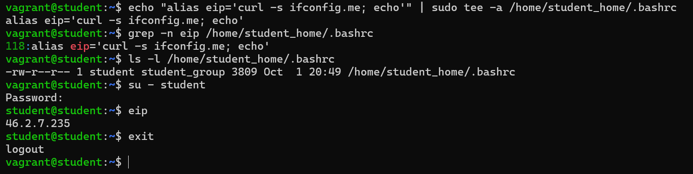

---

## 12. Static Route

**Hedef:** `8.8.8.8`'e giden paketler `4.4.4.4` üzerinden gitsin, kalıcı olsun. Diğer adresler etkilenmesin.

Önce `yq` kuruldu ve route öncesi durum kontrol edildi:

```bash
sudo wget -qO /usr/local/bin/yq https://github.com/mikefarah/yq/releases/latest/download/yq_linux_amd64
sudo chmod a+x /usr/local/bin/yq
yq --version
ping 8.8.8.8
```

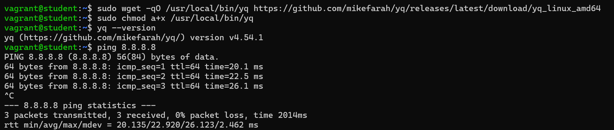

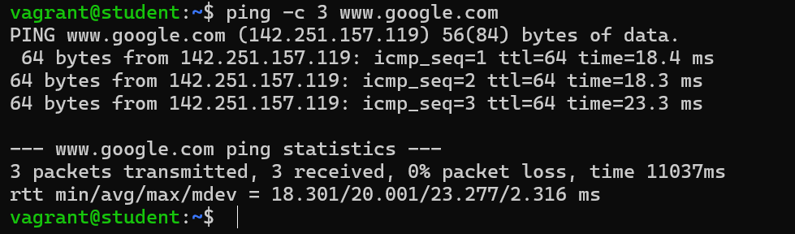

Arayüz adı (`enp0s3`) ve mevcut netplan dosyası:

```bash
ip route show default
sudo cat /etc/netplan/50-cloud-init.yaml
```

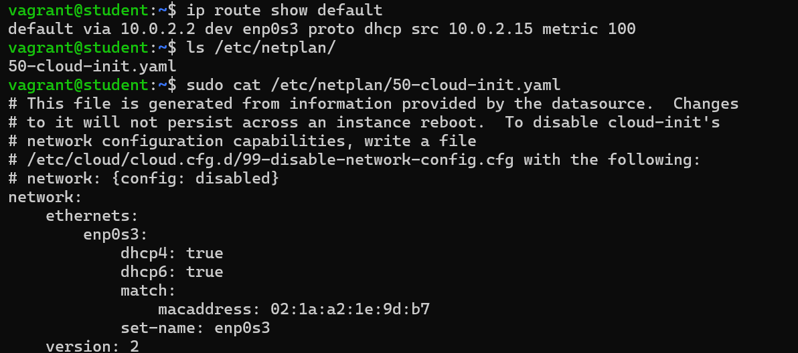

Netplan dosyasına `routes` bloğu eklenir:

```bash
sudo cp /etc/netplan/50-cloud-init.yaml ~/50-cloud-init.yaml.bak
sudo tee /etc/netplan/50-cloud-init.yaml > /dev/null <<'EOF'
network:
    ethernets:
        enp0s3:
            dhcp4: true
            dhcp6: true
            match:
                macaddress: 02:1a:a2:1e:9d:b7
            set-name: enp0s3
            routes:
              - to: 8.8.8.8/32
                via: 4.4.4.4
                on-link: true
    version: 2
EOF
```

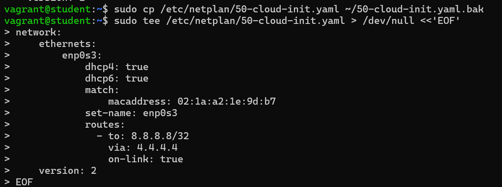

cloud-init'in dosyayı yeniden yazmasını engelle ve güvenli uygula:

```bash
echo 'network: {config: disabled}' | sudo tee /etc/cloud/cloud.cfg.d/99-disable-network-config.cfg
sudo netplan generate
sudo netplan try
```

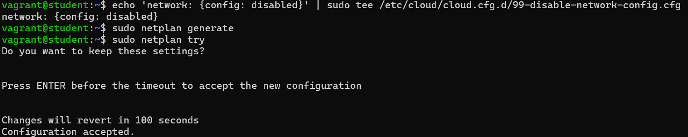

**Neden böyle?**

- **Kalıcılık için netplan:** `ip route add` ile eklenen route reboot sonrası kaybolur (geçici çözümdür). Netplan yapılandırması kalıcıdır ve uygulandığında route'u aynı anda route tablosuna da ekler, bu yüzden iki test de bu yöntemle geçer.
- `to: 8.8.8.8/32` sadece o tek adresi hedefler. `/32` tek bir IP demektir, bu yüzden diğer adresler etkilenmez.
- `on-link: true`: `4.4.4.4` yerel ağda olmadığı için ağ geçidinin doğrudan bağlı olduğunu söylemek gerekir. Aksi halde "invalid gateway" hatası alınır.
- `4.4.4.4` yerel ağdaki bir ağ geçidi değildir, ARP isteğine cevap vermez. Bu yüzden `8.8.8.8`'e giden paketler ulaşamaz. Bu, görevin beklenen sonucudur (`Destination Host Unreachable`).
- `netplan try`: yeni ayarı dener, onaylanmazsa **otomatik geri alır**. Hatalı bir ayarla SSH bağlantısını kaybetme riskini azaltır.
- `99-disable-network-config.cfg`, cloud-init'in `50-cloud-init.yaml` dosyasını her açılışta yeniden üretmesini engeller.

**Kontrol:**

```bash
ip route | grep 8.8.8.8
ping -c 2 8.8.8.8            # Destination Host Unreachable
ping -c 2 www.google.com     # çalışır
yq '.network.ethernets.enp0s3.routes' /etc/netplan/50-cloud-init.yaml
```

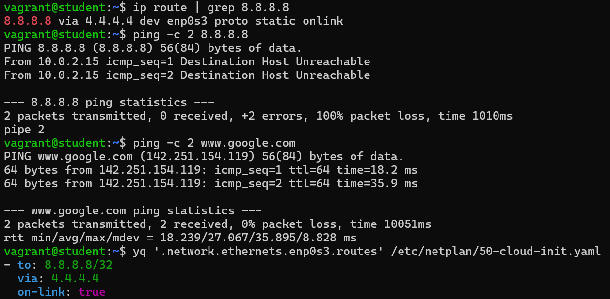

---

## Sonuç

Checker sonucu: **27 / 27 test geçti (%100).**

| # | Görev | Testler | Sonuç |
|---|-------|---------|-------|
| 1 | Change of VM hostname | 1-2 | ✅ |
| 2 | User Creation | 3-8 | ✅ |
| 3 | LVM Configuration | 9-12 | ✅ |
| 4 | Sudo Rights | 13 | ✅ |
| 5 | Swap Creation | 14-15 | ✅ |
| 6 | Docker Installation | 16 | ✅ |
| 7 | NGINX Installation | 17-21 | ✅ |
| 8 | Cron Job | 22 | ✅ |
| 9 | NGINX Logrotate | 23 | ✅ |
| 10 | Immutable file | 24 | ✅ |
| 11 | Bash Alias | 25 | ✅ |
| 12 | Static Route | 26-27 | ✅ |

## Karşılaşılan sorunlar

**`./checker: cannot execute binary file: Exec format error`**
Yanlış platformun checker dosyası indirilmişti. `file ~/checker` çıktısı `Mach-O 64-bit arm64` (macOS ARM) gösteriyordu. VM Linux x86_64 olduğu için **AMD64 (Linux)** sürümü indirilince çözüldü. Kontrol: `uname -m` ve `file ~/checker` (`ELF 64-bit ... x86-64` görülmeli).

**Hostname değişti ama prompt hâlâ `ubuntu-focal` gösteriyor**
Prompt, oturum açıldığında okunan ismi gösterir. `hostname` komutu `student` döndürüyorsa değişiklik tamamdır, yeni oturumda prompt da güncellenir.

**`ls /etc/sudoers.d/student` → Permission denied**
Dizin sadece root tarafından okunabilir. `sudo ls -l` ve `sudo cat` ile bakılır, sorun yoktur.

**Docker'da `permission denied ... docker.sock`**
Kullanıcı docker grubuna eklendikten sonra oturum yenilenmemişti. `exit` ile çıkıp tekrar girince çözüldü.

**`.bashrc`'de aynı alias iki kez**
Alias ekleme komutu iki kez çalıştırıldığı için `.bashrc`'ye aynı satır iki kez yazılmıştı. İşlevi bozmaz ama gereksizdir. Önce `sudo -u student sed -i '/alias eip=/d' /home/student_home/.bashrc` ile tüm `eip` satırları silindi, sonra alias **bir kez** eklendi. `>>` veya `tee -a` ile ekleme yapan komutlar her çalıştırmada satır ekler, bu yüzden tekrar çalıştırmadan önce `grep -n eip` ile kontrol etmek iyi bir alışkanlıktır.

**Cron yedekleri birikiyor**
Test için her dakika yedek alındığından `conf.d` hızla dolar. Testler geçtikten sonra sıklık saatliğe çekilebilir: `0 * * * *`.
