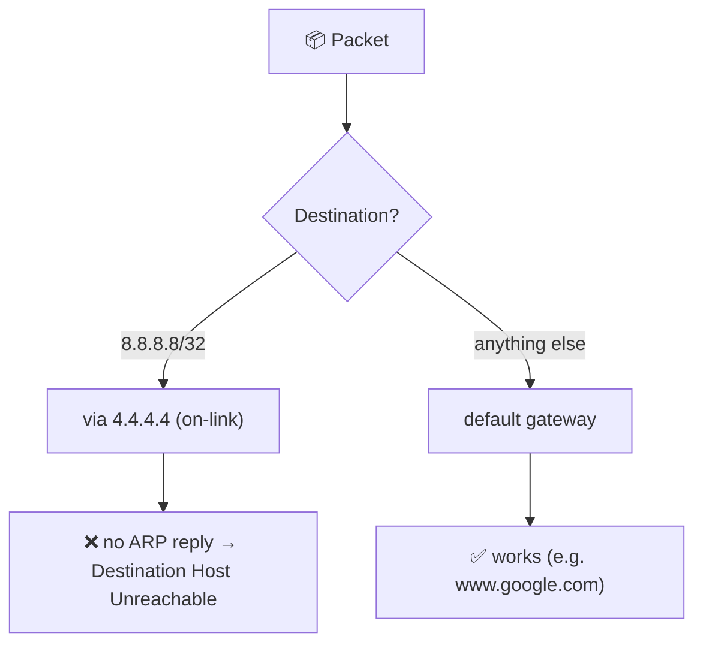

<div align="center">


# 🛠️ VM Task — Solution

**🇬🇧 English** · [🇹🇷 Türkçe](./SOLUTION.tr.md)

[⬅️ README](./README.md) · [📋 Task](./TASK.md)

</div>

For every task: what was done, the commands, a short rationale and a screenshot. The task itself is described in [TASK.md](./TASK.md).

## Contents

- [Environment](#environment)
- [Preparation](#preparation)
- [1. Change of VM hostname](#1-change-of-vm-hostname)
- [2. User Creation](#2-user-creation)
- [3. LVM Configuration](#3-lvm-configuration)
- [4. Sudo Rights](#4-sudo-rights)
- [5. Swap Creation](#5-swap-creation)
- [6. Docker Installation](#6-docker-installation)
- [7. NGINX Installation](#7-nginx-installation)
- [8. Cron Job](#8-cron-job)
- [9. NGINX Logrotate](#9-nginx-logrotate)
- [10. Make an immutable file /immutable.txt](#10-make-an-immutable-file-immutabletxt)
- [11. Bash Alias Creating](#11-bash-alias-creating)
- [12. Static Route](#12-static-route)
- [Result](#result)
- [Problems & fixes](#problems--fixes)

## Environment

|  |  |
|---|---|
| Host | Windows, PowerShell |
| Virtualization | VirtualBox 7.2 + Vagrant |
| Box | `ubuntu/focal64` |
| VM OS | Ubuntu 20.04.6 LTS (x86_64) |
| VM resources | 1 CPU, 2 GB RAM |
| Disks | `sda` 40 GB (system), `sdb` 10 MB (cloud-init), `sdc` 1 GB (for LVM) |

## Preparation

The VM was created with the [Vagrantfile](./Vagrantfile) in this folder (PowerShell):

```powershell
$env:VAGRANT_EXPERIMENTAL="disks"   # required for the disks feature
vagrant up
vagrant ssh
```

Initial state and required tools inside the VM:

```bash
lsblk                                   # the 1G disk sdc must be visible
swapon --show                           # must be empty (no swap)
sudo apt update && sudo apt install -y jq
cp /vagrant/checker ~ && chmod +x ~/checker
```

`/vagrant` is the VM-side share of the project folder on the host. The checker was copied from there.

<p align="center"><br><sub><em>lsblk: sdc is the 1G second disk</em></sub></p>
<p align="center"><br><sub><em>No swap at the start</em></sub></p>

---

## 1. Change of VM hostname

| ⭐ Points | 🧪 Tests |
|---|---|
| 2 | 1–2 |

**🎯 Goal:** Hostname `student`, resolving to `127.0.0.1`, persistent.

```bash
echo '127.0.0.1 student' | sudo tee -a /etc/hosts
sudo hostnamectl set-hostname student
sudo sed -i 's/^preserve_hostname: false/preserve_hostname: true/' /etc/cloud/cloud.cfg
grep preserve_hostname /etc/cloud/cloud.cfg
```

**💡 Why this way**

- Add the new name to `/etc/hosts` **first**. Otherwise the next `sudo` calls warn `unable to resolve host`.
- `hostnamectl set-hostname` writes the hostname persistently to `/etc/hostname`.
- On Vagrant/cloud-init images, `cloud-init` can reset the hostname at boot. `preserve_hostname: true` prevents that.

**🔍 Check:** `hostname -s`, `-f` → `student`; `hostname -i` → `127.0.0.1`.

<p align="center"><br><sub><em>Initial `/etc/hosts`</em></sub></p>

<p align="center"><br><sub><em>After the change</em></sub></p>

---

## 2. User Creation

| ⭐ Points | 🧪 Tests |
|---|---|
| 6 | 3–8 |

**🎯 Goal:** `student`, UID 1040, primary group `student_group` (GID 1050), home `/home/student_home`, supplementary group `cdrom`.

```bash
sudo groupadd -g 1050 student_group
sudo useradd -u 1040 -g student_group -G cdrom -d /home/student_home -m -s /bin/bash student
sudo passwd student
id student
```

**💡 Why this way**

- The primary group must exist **before** the user, so `groupadd` runs first.
- `-g` primary group, `-G` supplementary groups, `-d` home directory, `-m` creates it.
- A password is set because later tests (`su`, `sudo`) need it.

**🔍 Check:** Expected: `uid=1040(student) gid=1050(student_group) groups=1050(student_group),24(cdrom)`

<p align="center"><br><sub><em>User creation and `id` output</em></sub></p>

---

## 3. LVM Configuration

| ⭐ Points | 🧪 Tests |
|---|---|
| 4 | 9–12 |

**🎯 Goal:** PV on `sdc`, VG `student`, LV `student` (50% of free space), ext4, persistent mount on `/lvm/student` by UUID.

```bash
sudo pvcreate /dev/sdc
sudo vgcreate student /dev/sdc
sudo lvcreate -l 50%FREE -n student student
sudo mkfs.ext4 /dev/student/student
sudo mkdir -p /lvm/student

UUID=$(sudo blkid -s UUID -o value /dev/student/student)
echo "UUID=$UUID /lvm/student ext4 defaults 0 2" | sudo tee -a /etc/fstab
sudo mount -a
```

**💡 Why this way**

- LVM is built in layers: **PV** (physical disk) → **VG** (disk pool) → **LV** (usable logical partition) → filesystem.
- `-l 50%FREE` takes half of the free space in the volume group (about 508 MiB).
- fstab gets the **UUID** because `/dev/sdX` names can change after a reboot; a UUID does not.
- `mount -a` tries every fstab entry. No error means the line is correct.


**🔍 Check:** `lsblk | grep student-student`, `mount | grep student-student`, `sudo lvdisplay`.

<p align="center"><br><sub><em>PV, VG, LV creation and mkfs</em></sub></p>

<p align="center"><br><sub><em>fstab entry, mount and lvdisplay</em></sub></p>

---

## 4. Sudo Rights

| ⭐ Points | 🧪 Tests |
|---|---|
| 1 | 13 |

**🎯 Goal:** `student` runs `apt install` / `apt-get install` without a password and everything else with one. Default `/etc/sudoers` untouched.

```bash
which apt apt-get                          # /usr/bin/apt, /usr/bin/apt-get
sudo visudo -f /etc/sudoers.d/student
```

**📄 /etc/sudoers.d/student:**

```text
student ALL=(ALL) ALL
student ALL=(ALL) NOPASSWD: /usr/bin/apt install *, /usr/bin/apt-get install *
```

**💡 Why this way**

- **Best practice:** don't touch `/etc/sudoers`; use a per-user file in `/etc/sudoers.d/`. Package updates may change the main file, but your setting survives.
- `visudo -f` checks the syntax on save. A bad entry can break sudo; `visudo` prevents that.
- In sudoers the **last matching rule wins**. The general rule (`ALL`, password) goes first, the specific one (`NOPASSWD`, only apt install) goes last.
- Full paths (`/usr/bin/apt`) are used so no other `apt` can be run.
- The file mode must be `440` (`-r--r-----`); `visudo` sets it.

> [!NOTE]
> `/etc/sudoers.d/` is readable by root only. A "Permission denied" from `ls -l /etc/sudoers.d/student` as a normal user is expected; prefix it with `sudo`.

<p align="center"><br><sub><em>The sudoers.d file and its content</em></sub></p>

**Test** (as `su - student`, with `sudo -k` between steps):

- `sudo echo` → **asks** for a password
- `sudo apt install tree` → **does not ask**
- `sudo apt update` → **asks**

<p align="center"><br><sub><em>sudo echo asks for a password, apt install does not</em></sub></p>

<p align="center"><br><sub><em>sudo apt update asks for a password</em></sub></p>

---

## 5. Swap Creation

| ⭐ Points | 🧪 Tests |
|---|---|
| 2 | 14–15 |

**🎯 Goal:** 1 GB `/swapfile`, active after reboot.

```bash
sudo fallocate -l 1G /swapfile
sudo chmod 600 /swapfile
sudo mkswap /swapfile
sudo swapon /swapfile
echo '/swapfile none swap sw 0 0' | sudo tee -a /etc/fstab
sudo swapon --show
free -h | grep -i swap
```

**💡 Why this way**

- `fallocate` allocates a file of the requested size quickly.
- `chmod 600`: the swap file must be root-only, otherwise memory contents could be read by others.
- `mkswap` formats it as swap, `swapon` activates it.
- The fstab entry activates swap automatically at every boot.

**🔍 Check:** `swapon --show` → `/swapfile file 1024M`, `free -h` → `Swap: 1.0Gi`.

<p align="center"><br><sub><em>Swap file creation and verification</em></sub></p>

---

## 6. Docker Installation

| ⭐ Points | 🧪 Tests |
|---|---|
| 1 | 16 |

**🎯 Goal:** Docker **19.03.15** from the Docker repository, runnable by `student`.

Docker is not installed at the start:

<p align="center"><br><sub><em>Docker is not installed at the start</em></sub></p>

```bash
# 1. Prerequisites
sudo apt update
sudo apt install -y ca-certificates curl gnupg lsb-release

# 2. Docker GPG key
sudo mkdir -p /etc/apt/keyrings
curl -fsSL https://download.docker.com/linux/ubuntu/gpg | sudo gpg --dearmor -o /etc/apt/keyrings/docker.gpg

# 3. Docker repository
echo "deb [arch=$(dpkg --print-architecture) signed-by=/etc/apt/keyrings/docker.gpg] https://download.docker.com/linux/ubuntu $(lsb_release -cs) stable" | sudo tee /etc/apt/sources.list.d/docker.list
sudo apt update

# 4. Find the version and install it
apt-cache madison docker-ce | grep 19.03.15
VER="5:19.03.15~3-0~ubuntu-focal"
sudo apt install -y docker-ce=$VER docker-ce-cli=$VER containerd.io

# 5. Add users to the docker group
sudo usermod -aG docker student
sudo usermod -aG docker vagrant
```

**💡 Why this way**

- The task wants the **official Docker repository**, not Ubuntu's `docker.io` package, so the repo and GPG key are added. `signed-by` makes apt verify package signatures.
- `apt-cache madison` lists the available versions; the exact version string (`5:19.03.15~3-0~ubuntu-focal`) comes from it.
- A specific version is required, so `docker-ce` and `docker-ce-cli` are pinned to it.
- Members of the `docker` group can access `/var/run/docker.sock`, i.e. run Docker without `sudo`. The group change applies in a **new session** (`exit`, log in again).

**🔍 Check:** Client and Server must both show `19.03.15`.

<p align="center"><br><sub><em>docker version as `student`</em></sub></p>

<p align="center"><br><sub><em>docker version as `vagrant`</em></sub></p>

---

## 7. NGINX Installation

| ⭐ Points | 🧪 Tests |
|---|---|
| 5 | 17–21 |

**🎯 Goal:** NGINX on port 8080, a static page that returns JSON with `name`, `os`, `ip`, `cpu`, `memory`.

```bash
sudo apt install -y nginx

# Change the port from 80 to 8080
sudo sed -i 's/listen 80 default_server;/listen 8080 default_server;/; s/listen \[::\]:80 default_server;/listen [::]:8080 default_server;/' /etc/nginx/sites-available/default
grep listen /etc/nginx/sites-available/default

# JSON page (values are filled in automatically)
sudo tee /var/www/html/index.html > /dev/null <<EOF
{
  "name": "student",
  "os": "$(. /etc/os-release && echo $PRETTY_NAME)",
  "ip": "$(hostname -I | awk '{print $1}')",
  "cpu": "$(nproc)",
  "memory": "$(free -m | awk '/Mem:/ {printf "%.1f", $2/1024}')"
}
EOF

sudo nginx -t
sudo systemctl restart nginx
sudo systemctl enable nginx
```

**💡 Why this way**

- The default site ships with `listen 80`. Both the IPv4 (`listen 8080`) and IPv6 (`listen [::]:8080`) lines are changed.
- `index.html` lives in NGINX's default web root (`/var/www/html`). The `$(...)` expressions run while the file is written and are replaced by real values (the heredoc `EOF` is unquoted).
- `nginx -t` catches config errors without restarting the service.
- `enable` starts the service automatically at boot.

**🔍 Check:**

```bash
sudo ss -lntp | grep 8080
curl student:8080
curl -s student:8080 | jq .
```

<p align="center"><br><sub><em>NGINX installation</em></sub></p>

<p align="center"><br><sub><em>Port change and JSON page creation</em></sub></p>

<p align="center"><br><sub><em>nginx -t, restart, listening on 8080</em></sub></p>

<p align="center"><br><sub><em>JSON output with curl and jq</em></sub></p>

---

## 8. Cron Job

| ⭐ Points | 🧪 Tests |
|---|---|
| 1 | 22 |

**🎯 Goal:** Back up `/etc/nginx/nginx.conf` as `/etc/nginx/conf.d/nginx-<timestamp>.conf.bak`. No extra script.

`conf.d` is empty at the start:

<p align="center"><br><sub><em>`conf.d` is empty at the start</em></sub></p>

```bash
systemctl is-active cron
(sudo crontab -l 2>/dev/null; echo '* * * * * cp /etc/nginx/nginx.conf /etc/nginx/conf.d/nginx-$(date +\%s).conf.bak') | sudo crontab -
sudo crontab -l
sleep 70
ls /etc/nginx/conf.d/
```

**💡 Why this way**

- Only root can write to `/etc/nginx/conf.d/`, so the job goes into **root's crontab** (`sudo crontab`).
- `date +%s` returns seconds since 1970-01-01 (Unix timestamp).
- `%` is special in crontab, so it is written as `\%`.
- The backups end in `.conf.bak`, so NGINX does not include them (`conf.d/*.conf` only reads `.conf` files).
- `* * * * *` (every minute) was used for testing, so the result shows up within a minute.

<p align="center"><br><sub><em>Crontab line and the created backups</em></sub></p>

> [!TIP]
> In production use an hourly/daily schedule (`0 * * * *`) instead of every minute, otherwise the directory fills up quickly.

---

## 9. NGINX Logrotate

| ⭐ Points | 🧪 Tests |
|---|---|
| 1 | 23 |

**🎯 Goal:** Rotate NGINX logs **weekly** instead of daily.

The previous setting (`daily`, `rotate 14`) is visible at the bottom of the previous task's last screenshot.

```bash
sudo sed -i 's/\bdaily\b/weekly/' /etc/logrotate.d/nginx
grep -E 'daily|weekly|rotate' /etc/logrotate.d/nginx
sudo logrotate -d /etc/logrotate.d/nginx 2>&1 | grep -i rotating
```

**💡 Why this way**

- `logrotate` settings live in `/etc/logrotate.d/`. For NGINX, `daily` becomes `weekly`.
- `\b` is a word boundary, so only the word `daily` is matched.
- `logrotate -d` (debug) shows how the rule is interpreted without changing anything.

**🔍 Check:** Expected: `rotating pattern: /var/log/nginx/*.log  weekly (14 rotations)`

<p align="center"><br><sub><em>logrotate is now weekly</em></sub></p>

---

## 10. Make an immutable file /immutable.txt

| ⭐ Points | 🧪 Tests |
|---|---|
| 1 | 24 |

**🎯 Goal:** Owner `student`, group `cdrom`, all permissions for everyone, nobody can delete it.

```bash
sudo touch /immutable.txt
sudo chown student:cdrom /immutable.txt
sudo chmod 777 /immutable.txt
sudo chattr +i /immutable.txt

ls -l /immutable.txt
lsattr /immutable.txt
sudo rm /immutable.txt        # Operation not permitted
```

**💡 Why this way**

- `chattr +i` sets the **immutable** flag: the file cannot be deleted, renamed or modified by **anyone, root included**.
- Once set, owner and permissions can't be changed either, so `chattr +i` runs **last**.
- Remove the flag with `sudo chattr -i /immutable.txt`.

<p align="center"><br><sub><em>Immutable file: permissions, lsattr and a delete attempt</em></sub></p>

---

## 11. Bash Alias Creating

| ⭐ Points | 🧪 Tests |
|---|---|
| 1 | 25 |

**🎯 Goal:** Alias `eip` for `student` shows the external IP, persistently.

The alias doesn't exist at the start:

<p align="center"><br><sub><em>The alias doesn't exist at the start</em></sub></p>

```bash
echo "alias eip='curl -s ifconfig.me; echo'" | sudo tee -a /home/student_home/.bashrc
grep -n eip /home/student_home/.bashrc
su - student
eip
```

**💡 Why this way**

- `student`'s home is `/home/student_home`, so the alias goes there (not `/home/student/.bashrc`).
- `.bashrc` is read by every interactive Bash session, so the alias survives reboots.
- `curl -s ifconfig.me` returns the external IP. The service sends no trailing newline, so `echo` is appended.
- Aliases only work in **interactive** sessions, so the test uses `su - student`.

<p align="center"><br><sub><em>eip shows the external IP address</em></sub></p>

---

## 12. Static Route

| ⭐ Points | 🧪 Tests |
|---|---|
| 2 | 26–27 |

**🎯 Goal:** Packets for `8.8.8.8` go through `4.4.4.4`, persistently. Other destinations unaffected.


First `yq` was installed and the state before the route was checked:

```bash
sudo wget -qO /usr/local/bin/yq https://github.com/mikefarah/yq/releases/latest/download/yq_linux_amd64
sudo chmod a+x /usr/local/bin/yq
yq --version
ping 8.8.8.8
```

<p align="center"><br><sub><em>yq installation and ping to 8.8.8.8 before the route</em></sub></p>
<p align="center"><br><sub><em>ping www.google.com before the route</em></sub></p>

Interface name (`enp0s3`) and the current netplan file:

```bash
ip route show default
sudo cat /etc/netplan/50-cloud-init.yaml
```

<p align="center"><br><sub><em>Current netplan configuration</em></sub></p>

A `routes` block is added to the netplan file:

```bash
sudo cp /etc/netplan/50-cloud-init.yaml ~/50-cloud-init.yaml.bak
sudo tee /etc/netplan/50-cloud-init.yaml > /dev/null <<'EOF'
network:
    ethernets:
        enp0s3:
            dhcp4: true
            dhcp6: true
            match:
                macaddress: 02:1a:a2:1e:9d:b7
            set-name: enp0s3
            routes:
              - to: 8.8.8.8/32
                via: 4.4.4.4
                on-link: true
    version: 2
EOF
```

<p align="center"><br><sub><em>New content of the netplan file</em></sub></p>

Stop cloud-init from rewriting the file, and apply safely:

```bash
echo 'network: {config: disabled}' | sudo tee /etc/cloud/cloud.cfg.d/99-disable-network-config.cfg
sudo netplan generate
sudo netplan try
```

<p align="center"><br><sub><em>cloud-init network config disabled, netplan try</em></sub></p>

**💡 Why this way**

- **Netplan for persistence:** a route added with `ip route add` disappears after a reboot. A netplan config is persistent and also adds the route to the routing table when applied, so both tests pass with this method.
- `to: 8.8.8.8/32` targets that single address only. `/32` means one IP, so other destinations are unaffected.
- `on-link: true`: `4.4.4.4` is not on the local network, so we must declare the gateway as directly reachable. Otherwise you get an "invalid gateway" error.
- `4.4.4.4` is not a gateway on the local network and never answers ARP, so packets to `8.8.8.8` can't get through. That is the expected result of the task (`Destination Host Unreachable`).
- `netplan try` applies the config and **rolls back automatically** unless confirmed. This lowers the risk of losing the SSH session.
- `99-disable-network-config.cfg` stops cloud-init from regenerating `50-cloud-init.yaml` at every boot.

**Which way does a packet go?**




**🔍 Check:**

```bash
ip route | grep 8.8.8.8
ping -c 2 8.8.8.8            # Destination Host Unreachable
ping -c 2 www.google.com     # works
yq '.network.ethernets.enp0s3.routes' /etc/netplan/50-cloud-init.yaml
```

<p align="center"><br><sub><em>Route in the table, 8.8.8.8 unreachable, google.com works</em></sub></p>

---

## Result

Checker result: **27 / 27 tests passed (100%).**

| # | Task | Tests | Result |
|---|---|---|---|
| 1 | Change of VM hostname | 1–2 | ✅ |
| 2 | User Creation | 3–8 | ✅ |
| 3 | LVM Configuration | 9–12 | ✅ |
| 4 | Sudo Rights | 13 | ✅ |
| 5 | Swap Creation | 14–15 | ✅ |
| 6 | Docker Installation | 16 | ✅ |
| 7 | NGINX Installation | 17–21 | ✅ |
| 8 | Cron Job | 22 | ✅ |
| 9 | NGINX Logrotate | 23 | ✅ |
| 10 | Make an immutable file /immutable.txt | 24 | ✅ |
| 11 | Bash Alias Creating | 25 | ✅ |
| 12 | Static Route | 26–27 | ✅ |

## Problems & fixes

| Problem | Cause | Fix |
|---|---|---|
| `./checker: cannot execute binary file: Exec format error` | The checker for the wrong platform was downloaded. `file ~/checker` showed `Mach-O 64-bit arm64` (macOS ARM) but the VM is Linux x86_64. | Download the **AMD64 (Linux)** build. Verify with `uname -m` and `file ~/checker` (expect `ELF 64-bit ... x86-64`). |
| Hostname changed but the prompt still shows `ubuntu-focal` | The prompt shows the name read when the session started. | If `hostname` prints `student`, the change is done. A new session shows it in the prompt too. |
| `ls /etc/sudoers.d/student` → Permission denied | The directory is readable by root only. | Use `sudo ls -l` and `sudo cat`. Nothing is wrong. |
| Docker: `permission denied ... docker.sock` | The user was added to the docker group but the session wasn't refreshed. | `exit` and log in again. |
| Same alias twice in `.bashrc` | The append command was run twice. Harmless but redundant. | `sudo -u student sed -i '/alias eip=/d' /home/student_home/.bashrc`, then add the alias **once**. Commands using `>>` or `tee -a` add a line every run, so check with `grep -n eip` before re-running. |
| Cron backups pile up | A backup every minute fills `conf.d` quickly. | After the tests pass, switch to hourly: `0 * * * *`. |
